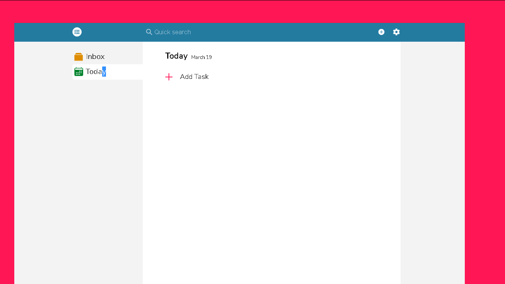
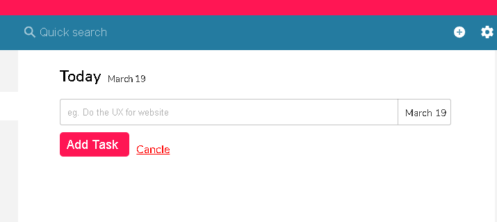
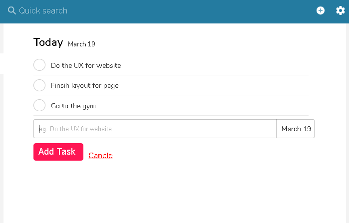
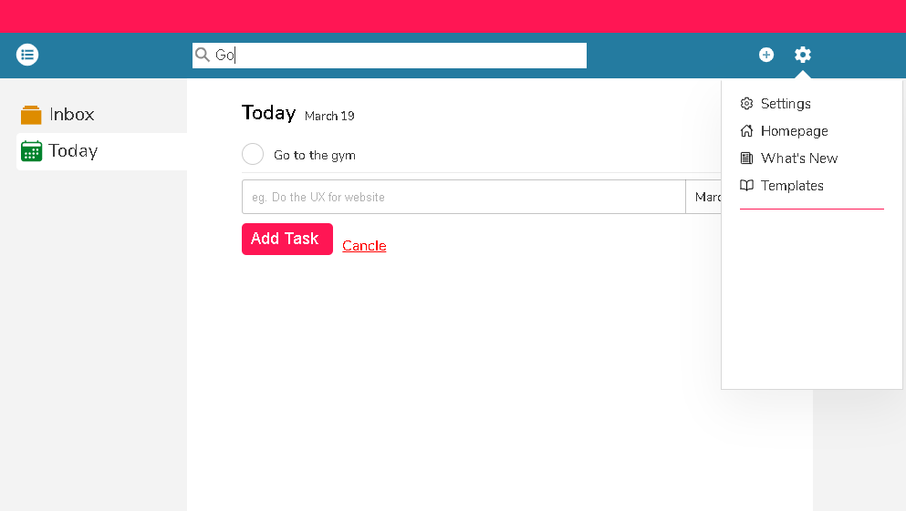

# To do app Made with Vanilla JS with module design pattern
- Really beutiful App where i implemented everything i learnt from online courses and of course extended features
### Built with
- JS module pattern
- SASS
- CSS3 Animations and so on.
<<<<<<< HEAD

### Images

-----------------------

-----------------------

-----------------------

